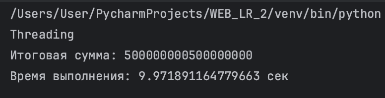
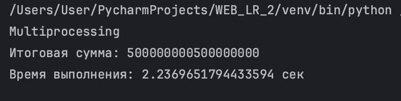
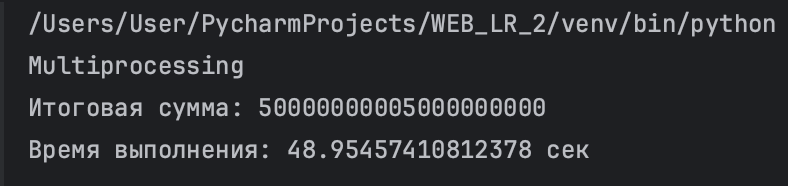
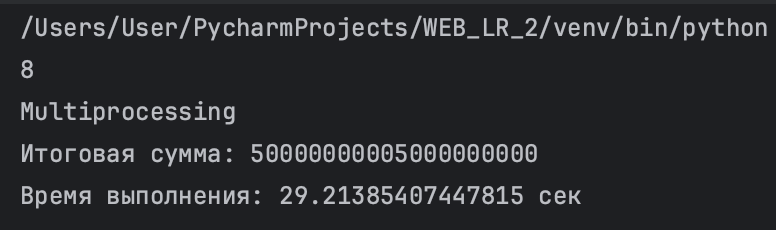
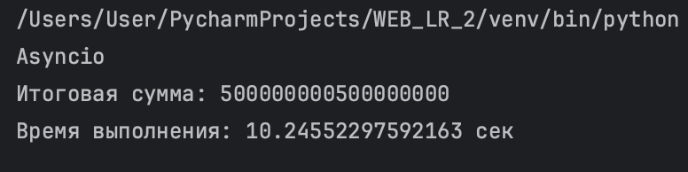
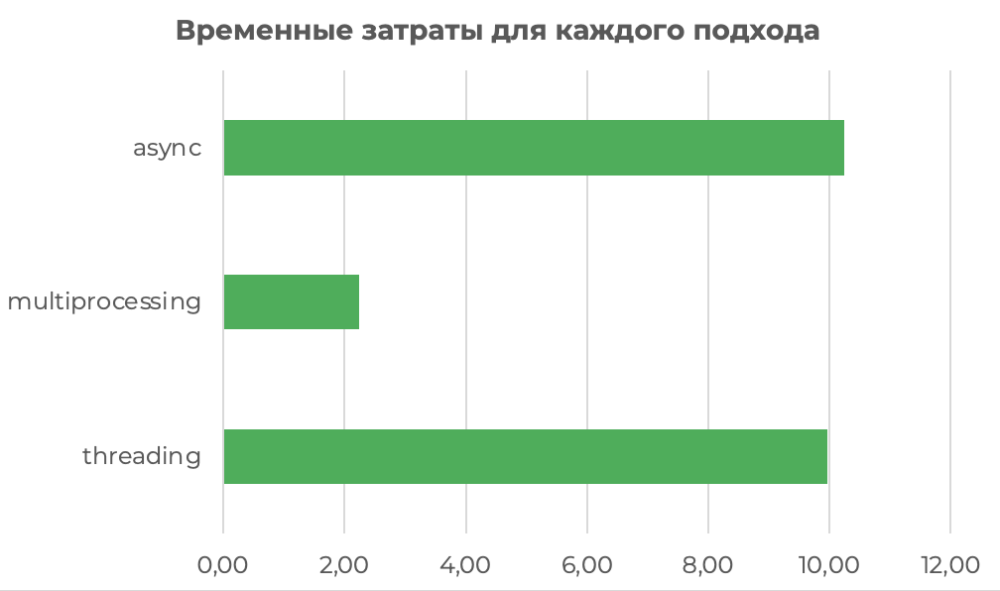

## Задание №1. Различия между threading, multiprocessing и async в Python

### Цель: 
В рамках данного задания необходимо было написать три различных программы на Python, использующие каждый из подходов: threading, multiprocessing и async. 
Каждая программа должна считать сумму всех чисел от 1 до 10^9.

### Ход работы: 
Рассмотрим реализацию каждого подхода:

1.Threading. Через строго равные промежутки времени происходит попеременное переключение то на одну, то на другую задачу. 
```
import threading
import time

def partial_sum(start, end, result, index):
    result[index] = sum(range(start, end))

def calculate_sum():
    num_threads = 4
    maximum = 10**9
    step = maximum // num_threads
    threads = []
    results = [0] * num_threads
    for i in range(num_threads):
        start = i * step + 1
        if i != num_threads - 1:
            end = (i + 1) * step + 1
        else:
            end = maximum + 1
        t = threading.Thread(target=partial_sum, args=(start, end, results, i))
        threads.append(t)
        t.start()
    for t in threads:
        t.join()
    return sum(results)
```
В результате получаем:




2.Multiprocessing. Вычисления идут параллельно
```
import multiprocessing
import time

def partial_sum(start, end, result, index):
    result[index] = sum(range(start, end))

def calculate_sum():
    num_processes = multiprocessing.cpu_count()
    maximum = 10**9
    step = maximum // num_processes
    manager = multiprocessing.Manager()
    processes = []
    results = manager.list([0] * num_processes)

    for i in range(num_processes):
        start = i * step + 1
        if i != num_processes - 1:
            end = (i + 1) * step + 1
        else:
            end = maximum + 1
        process = multiprocessing.Process(target=partial_sum, args=(start, end, results, i))
        processes.append(process)
        process.start()

    for process in processes:
        process.join()

    return sum(results)
```
Сначала посомтрим на результаты при стандартном наборе входных параметров:


Далее в рамках этого подхода проведем небольшое исследование. Попробуем посомтреть на изменение работы кода при корректировке переменной num_processes, которая как раз-таки распределяет наш процесс на потоки.
Начнем с 4х ядер:



А затем посмотрим на 8 ядер (максимальное количество):



Можно сразу заметить сильный разброс во времени и в суммарной нагрузке на ЦП. Увеличив величив num_processes с 4 до 8, мы задействовали все ядра (и производительности, и эффективности). Время работы сильно сократилось, а это значит, что наша задача хорошо масштабируется по ядрам и реально выигрывает при использоании multiprocessing.


3.Asyncio
```
import asyncio
import time

async def partial_sum(start, end):
    return sum(range(start, end))

async def calculate_sum():
    num_tasks = 4
    maximum = 10 ** 9
    step = maximum // num_tasks
    tasks = []

    for i in range(num_tasks):
        start = i * step + 1
        if i != num_tasks - 1:
            end = (i + 1) * step + 1
        else:
            end = maximum + 1
        task = asyncio.create_task(partial_sum(start, end))
        tasks.append(task)

    results = await asyncio.gather(*tasks)
    return sum(results)
```
В результате получаем:



Теперь посомтрим на график распределения времени для каждого процесса при 10^9 и 4х потоках:




### Вывод: 
Multiprocessing получился самым эффективным способом в рамках задачи. В Python есть ограничение, называемое GIL, которое мешает потокам работать одновременно. Но процессы в multiprocessing GIL не ограничивает, поэтому это круто работает для тяжёлых задач — типа вычислений, обработки видео или изображений. Также каждый процесс может параллельно использовать ядра процессора. В результате — значительное ускорение.

Threadings занимает второе место. Достаточно медленный из-за GIL. Тут параллельности нет (и ускорения тоже), в итоге задачи исполняются по очереди.

Async - третье место. Тут тоже идет последовательное исполнение, нет ускорения, ну и асинхронность в нашей задаче ничего не даёт, потому что нет операций, которые можно "ждать". 