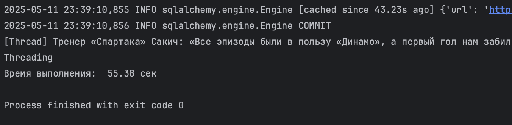
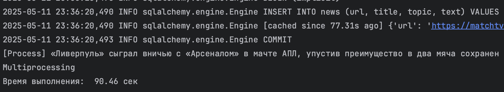
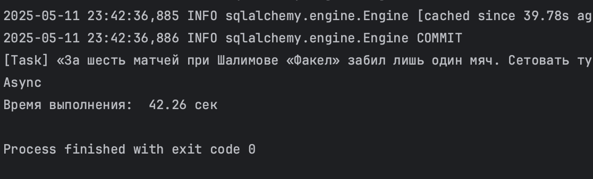
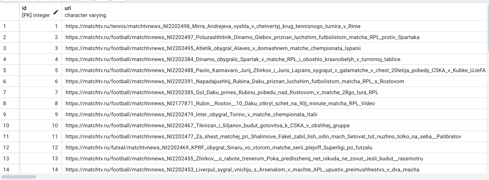

### Задание №2. Параллельный парсинг веб-страниц с сохранением в базу данных

### Цель: 
Написать программу на Python для параллельного парсинга нескольких веб-страниц с сохранением данных в базу данных с использованием подходов threading, multiprocessing и async. Каждая программа должна парсить информацию с нескольких веб-сайтов, сохранять их в базу данных.

### Ход работы: 
В рамках данной лабораторной работы был выбран ресурс "МАТЧ ТВ", а в качества объекта парсинга - новости. 
Первым делом было реализовано подключение к бд и создание модели новости:
```
from contextlib import contextmanager
from sqlmodel import SQLModel, create_engine, Session
import os
from dotenv import load_dotenv

load_dotenv()
db_url = os.getenv('DB_ADMIN')
engine = create_engine(db_url, echo=True)


def init_db():
    SQLModel.metadata.drop_all(engine)
    SQLModel.metadata.create_all(engine)

@contextmanager
def get_session():
    session = Session(engine)
    try:
        yield session
    finally:
        session.close()
```

```
class News(SQLModel, table=True):
    id: int = Field(default=None, primary_key=True)
    url: str
    title: str
    topic: str
    text: str
```

И подготовим универсальные функции для парсинга:
```
def get_article_text(url):
    response = requests.get(url)
    soup = BeautifulSoup(response.text, "html.parser")
    content_div = soup.find("div", class_="article__content")
    if not content_div:
        return "Нет основного текста"
    paragraphs = content_div.find_all("p")
    text = "\n".join(p.get_text(strip=True) for p in paragraphs)
    return text


def get_articles():
    response = requests.get("https://matchtv.ru/news")
    soup = BeautifulSoup(response.text, "html.parser")
    articles = soup.find_all("a", class_="node-news-list__item")
    return articles


def get_topic(url):
    response = requests.get(url)
    soup = BeautifulSoup(response.text, "html.parser")
    topic_elem = soup.find_all("li", class_="credits__item")
    return topic_elem[1].get_text(strip=True) if topic_elem else None
```

Далее приступаем к реализации каждого процесса:
1.Threading.
```
def parse_and_save(article):
    try:
        href = article.get("href")
        full_url = "https://matchtv.ru" + href
        title_elem = article.find("div", class_="node-news-list__title")
        title = title_elem.get_text(strip=True) if title_elem else "Нет заголовка"
        topic_elem = article.find_all("li", class_="credits__item")
        topic = topic_elem[1].get_text(strip=True) if topic_elem else "Нет темы"
        result = {
            "url": full_url,
            "title": title,
            "topic": topic,
            "text": get_article_text(full_url)
        }
        with get_session() as session:
            new = News.model_validate(result)
            session.add(new)
            session.commit()
        print(f"[Thread] {title} сохранена")
    except Exception as e:
        print(f"[Thread Error] № {title}: {e}")


def handle_article_threading(chunk):
    for article in chunk:
        parse_and_save(article)


def main():
    articles = get_articles()
    num_threads = 4
    step = len(articles) // num_threads
    threads = []

    for i in range(num_threads):
        start = i * step
        if i != num_threads - 1:
            end = (i + 1) * step + 1
        else:
            end = len(articles) + 1
        t = threading.Thread(target=handle_article_threading, args=(articles[start:end],))
        threads.append(t)
        t.start()

    for t in threads:
        t.join()


if __name__ == "__main__":
    init_db()
    start = time.time()
    main()
    print("Threading")
    print(f"Время выполнения: {time.time() - start: .2f} сек")
```

В результате получаем:


2.Multiprocessing.
```
def parse_and_save(href, title):
    try:
        full_url = "https://matchtv.ru" + href
        topic_elem = get_topic(full_url)
        topic = topic_elem if topic_elem else "Нет темы"
        result = {
            "url": full_url,
            "title": title,
            "topic": topic,
            "text": get_article_text(full_url)
        }
        with get_session() as session:
            new = News.model_validate(result)
            session.add(new)
            session.commit()
        print(f"[Process] {title} сохранен")
    except Exception as e:
        print(f"[Process Error] № {title}: {e}")


def handle_article_threading(chunk):
    for href, title in chunk:
        parse_and_save(href, title)


def main():
    articles = get_articles()
    num_processes = 4
    step = len(articles) // num_processes
    processes = []

    for i in range(num_processes):
        start = i * step
        if i != num_processes - 1:
            end = (i + 1) * step + 1
        else:
            end = len(articles) + 1
        chunk_data = [(a.get("href"),
                       a.find("div", class_="node-news-list__title").get_text(strip=True) if a.find("div", class_="node-news-list__title") else "Нет заголовка")
                      for a in articles[start:end]]
        process = multiprocessing.Process(target=handle_article_threading, args=(chunk_data,))
        processes.append(process)
        process.start()

    for process in processes:
        process.join()


if __name__ == "__main__":
    init_db()
    start = time.time()
    main()
    print("Multiprocessing")
    print(f"Время выполнения: {time.time() - start: .2f} сек")
```

В результате получаем:



3.Asyncio
```
async def get_article_text(url, session):
    try:
        async with session.get(url) as response:
            html = await response.text()
            soup = BeautifulSoup(html, "html.parser")
            content_div = soup.find("div", class_="article__content")
            if not content_div:
                return "Нет основного текста"
            paragraphs = content_div.find_all("p")
            return "\n".join(p.get_text(strip=True) for p in paragraphs)
    except Exception as e:
        print(f"[Async Error] {url}: {e}")
        return "Ошибка при получении текста"


async def get_articles():
    connector = aiohttp.TCPConnector(ssl=False)
    async with aiohttp.ClientSession(connector=connector) as session:
        try:
            async with session.get("https://matchtv.ru/news") as response:
                html = await response.text()
                soup = BeautifulSoup(html, "html.parser")
                return soup.find_all("a", class_="node-news-list__item")
        except Exception as e:
            print(f"[Async Error] get_articles: {e}")
            return []


async def parse_and_save(article, session):
    try:
        href = article.get("href")
        full_url = "https://matchtv.ru" + href
        title_elem = article.find("div", class_="node-news-list__title")
        title = title_elem.get_text(strip=True) if title_elem else "Нет заголовка"
        topic_elem = article.find_all("li", class_="credits__item")
        topic = topic_elem[1].get_text(strip=True) if topic_elem else "Нет темы"

        text = await get_article_text(full_url, session)
        result = {
            "url": full_url,
            "title": title,
            "topic": topic,
            "text": text
        }

        with get_session() as db_session:
            new = News.model_validate(result)
            db_session.add(new)
            db_session.commit()

        print(f"[Task] {title} сохранена")
    except Exception as e:
        print(f"[Task Error] № {title}: {e}")


async def handle_article_async(chunk):
    async def run_articles():
        connector = aiohttp.TCPConnector(ssl=False)
        async with aiohttp.ClientSession(connector=connector) as session:
            tasks = [parse_and_save(article, session) for article in chunk]
            await asyncio.gather(*tasks)
    await run_articles()


async def main():
    articles = await get_articles()
    num_tasks = 4
    step = len(articles) // num_tasks

    for i in range(num_tasks):
        start = i * step
        if i != num_tasks - 1:
            end = (i + 1) * step + 1
        else:
            end = len(articles) + 1
        await handle_article_async(articles[start:end])


if __name__ == "__main__":
    init_db()
    start = time.time()
    asyncio.run(main())
    print("Async")
    print(f"Время выполнения: {time.time() - start: .2f} сек")

```

В результате получаем:



Ну и на последок посмотрим, как заполняется бд:


### Вывод: 
Async стал самым быстрым по времени работы. Ввиду того, что парсинг это IO-задача (ввод-вывод) и требуется ожидание при загрузке страниц. Вместо ожидания ответа от сервера, код сразу переключается на другую задачу — нет простаивания.

Threading стал вторым по скорости работы. Также хорош для IO-задач (ввод-вывод), но ожидание в рамках многопоточности обходится явно дороже, чем в асинхронности.

Multiprocessing крайне неэффективен при парсинге, так как больше полезен при тяжёлых вычислениях и происходит переплата по ресурсам для лёгких задач. Создаются полноценные процессы, а не потоки, поэтому и получается проигрыш по времени.