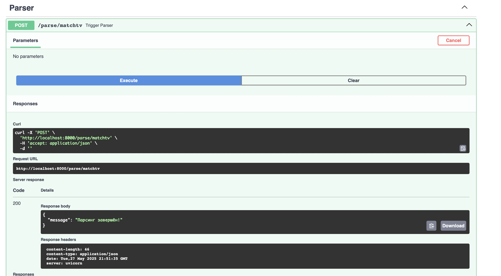
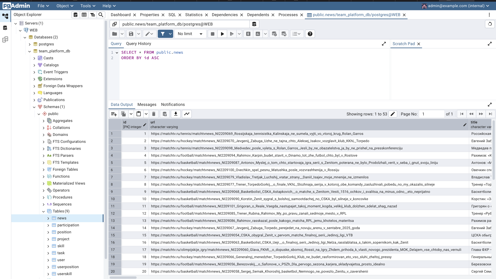
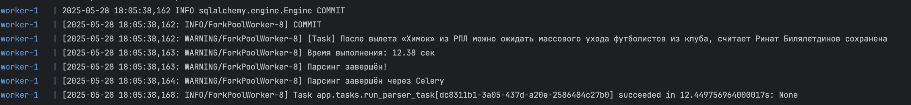
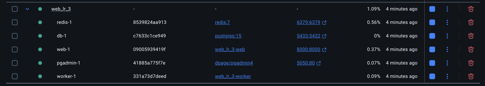

## Упаковка FastAPI приложения в Docker, Работа с источниками данных и Очереди

В рамках данного задания были взяты FastAPI приложение (создано в рамках лабораторной работы номер 1), база данных (аналогично создано в рамках лабораторной работы номер 1) и парсера данных (создано в рамках лабораторной работы номер 2)

Сам Docker файл:
```
FROM python:3.11-slim

WORKDIR /app

COPY requirements.txt .
RUN pip install --no-cache-dir -r requirements.txt

COPY ./app ./app
COPY .env .

EXPOSE 8000

CMD ["uvicorn", "app.main:app", "--host", "0.0.0.0", "--port", "8000"]
```

Файл docker-compose.yml
```
version: "3.9"

services:

  db:
    image: postgres:15
    restart: always
    environment:
      POSTGRES_USER: postgres
      POSTGRES_PASSWORD: Masha1226
      POSTGRES_DB: team_platform_db
    ports:
      - "5433:5432"
    volumes:
      - postgres_data:/var/lib/postgresql/data

  web:
    build: .
    restart: always
    depends_on:
      - db
    ports:
      - "8000:8000"
    env_file:
      - .env
    environment:
      DB_ADMIN: postgresql+psycopg2://postgres:Masha1226@db:5432/team_platform_db
    command: uvicorn app.main:app --host 0.0.0.0 --port 8000

  pgadmin:
    image: dpage/pgadmin4
    restart: always
    environment:
      PGADMIN_DEFAULT_EMAIL: admin@example.com
      PGADMIN_DEFAULT_PASSWORD: admin
    ports:
      - "5050:80"
    depends_on:
      - db
    volumes:
      - pgadmin_data:/var/lib/pgadmin

volumes:
  postgres_data:
  pgadmin_data:
```

Прокидываем 3 контейнера: для запуска бд, для инициализации pgadmin и для запуска приложения на FastAPI

Далее реулизуем возможность вызова парсера по http. Для этого прокинем дополнительный эндпоинт
```
from fastapi import APIRouter
from app.async_parser import run_parser
from app.tasks import run_parser_task
import asyncio

parser_router = APIRouter()

def sync_parser_runner():
    asyncio.run(run_parser())


@parser_router.post("/parse/matchtv", tags=['Parser'], status_code=202)
def trigger_parser():
    run_parser_task.delay()
    return {"message": ""}
```

Результат:



Ну и подключим все руты в проиложении:
```
from fastapi import FastAPI
from app.user_endpoints import user_router
from app.team_platform_endpoints import team_platform_router
from app.parser_endpoint import parser_router
from app.connection import init_db

app = FastAPI()
app.include_router(user_router)
app.include_router(team_platform_router)
app.include_router(parser_router)


@app.on_event("startup")
def on_startup():
    init_db()
```

Посмотрим, что происходит на стороне бд:



А теперь подключим Celery + Redis в стек. Нам необходимо:
1. Создать работника
```
from celery import Celery

celery_app = Celery(
    "worker",
    broker="redis://redis:6379/0",
    backend="redis://redis:6379/0"
)

celery_app.conf.task_routes = {
    "app.tasks.run_parser_task": {"queue": "parser"}
}

import app.tasks
```

2. Создать задачу для выполнения
```
from app.celery_worker import celery_app
from app.async_parser import run_parser
import asyncio


@celery_app.task(name="app.tasks.run_parser_task")
def run_parser_task():
    print("Парсинг начат через Celery")
    asyncio.run(run_parser())
    print("Парсинг завершён через Celery")

```

3. Добавить эндпоинт для вызова
```
parser_router = APIRouter()


def sync_parser_runner():
    asyncio.run(run_parser())


@parser_router.post("/parse/matchtv", tags=['Parser'], status_code=202)
def trigger_parser():
    run_parser_task.delay()
    return {"message": "Парсинг запущен в фоне через Celery"}
```

4. Отредактировать докер для вызова Celery и Redis
```
version: "3.9"

services:

  db:
    image: postgres:15
    restart: always
    environment:
      POSTGRES_USER: ${POSTGRES_USER}
      POSTGRES_PASSWORD: ${POSTGRES_PASSWORD}
      POSTGRES_DB: ${POSTGRES_DB}
    ports:
      - "5433:5432"
    volumes:
      - postgres_data:/var/lib/postgresql/data

  web:
    build: .
    restart: always
    depends_on:
      - db
      - redis
    ports:
      - "8000:8000"
    env_file:
      - .env
    environment:
      DB_ADMIN: ${DB_ADMIN}
    command: uvicorn app.main:app --host 0.0.0.0 --port 8000

  pgadmin:
    image: dpage/pgadmin4
    restart: always
    environment:
      PGADMIN_DEFAULT_EMAIL: ${PGADMIN_DEFAULT_EMAIL}
      PGADMIN_DEFAULT_PASSWORD: ${PGADMIN_DEFAULT_PASSWORD}
    ports:
      - "5050:80"
    depends_on:
      - db
    volumes:
      - pgadmin_data:/var/lib/pgadmin

  redis:
    image: redis:7
    ports:
      - "6379:6379"

  worker:
    build: .
    command: celery -A app.celery_worker.celery_app worker --loglevel=info -Q parser
    depends_on:
      - redis
      - web
    volumes:
      - .:/app

volumes:
  postgres_data:
  pgadmin_data:
```
В результате после запуска работа прошла успешно:



Напоследок глянем на составляющие части докер контейнера:


