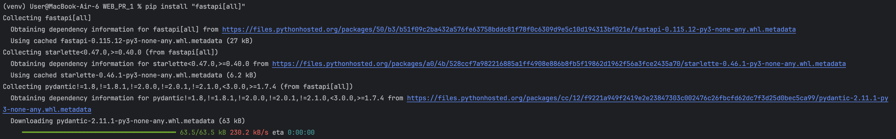
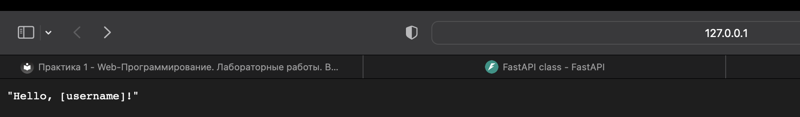
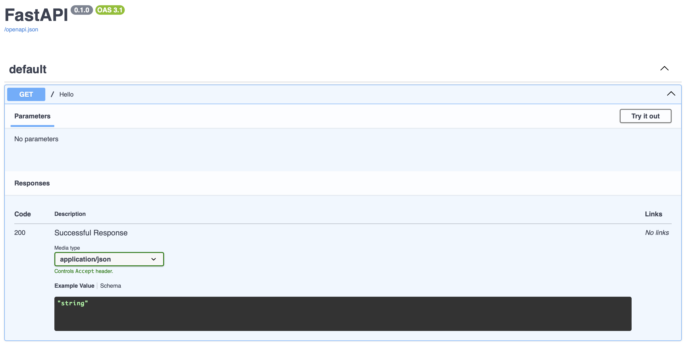
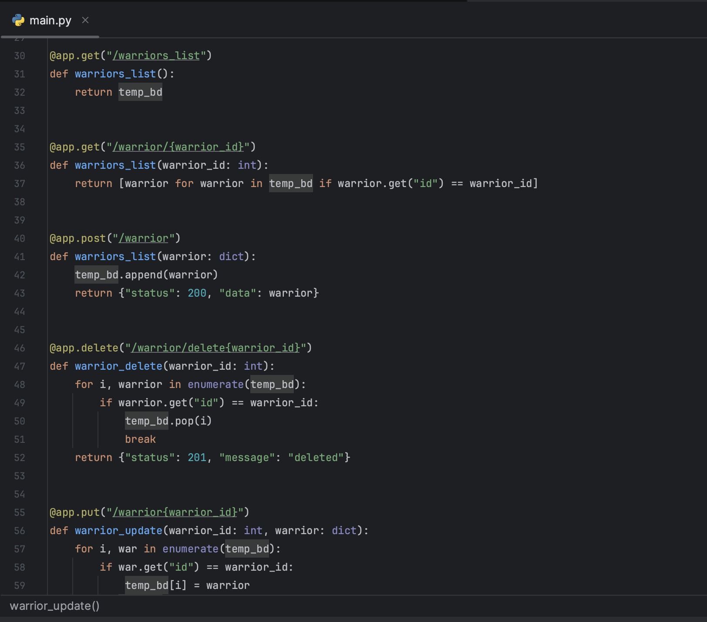
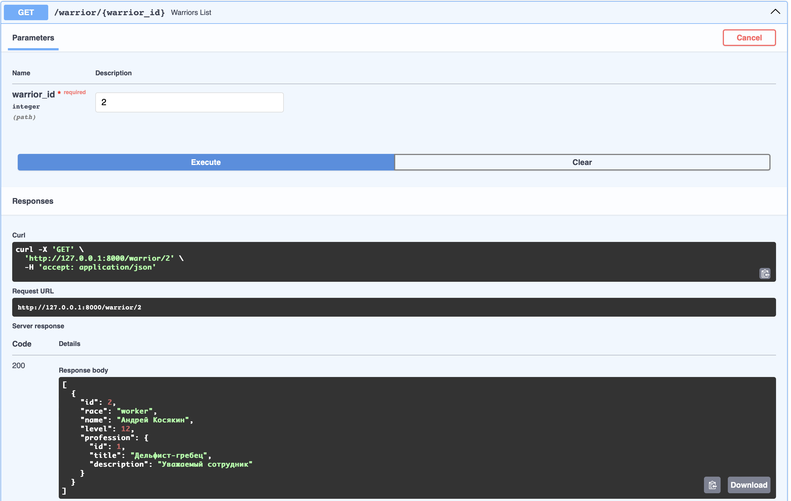
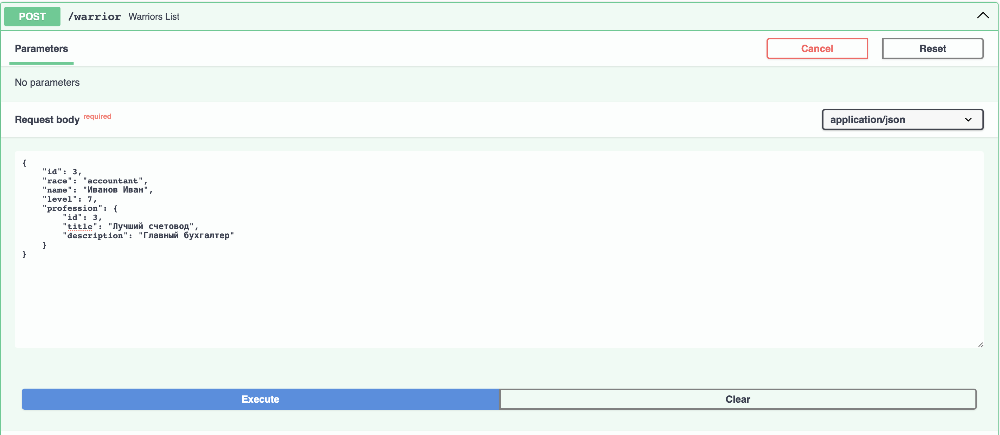
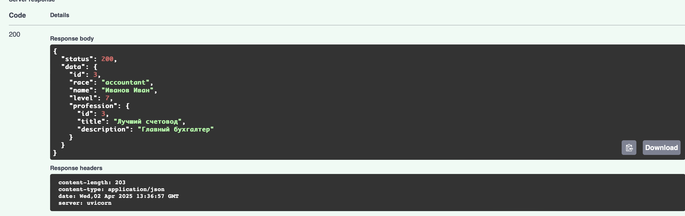
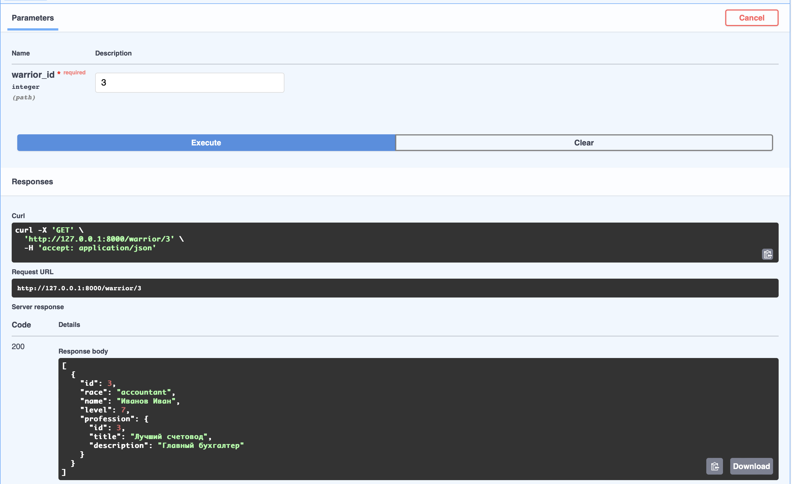
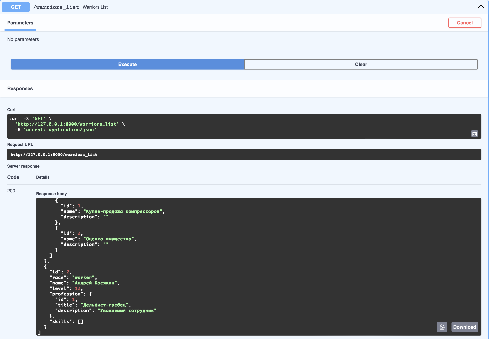
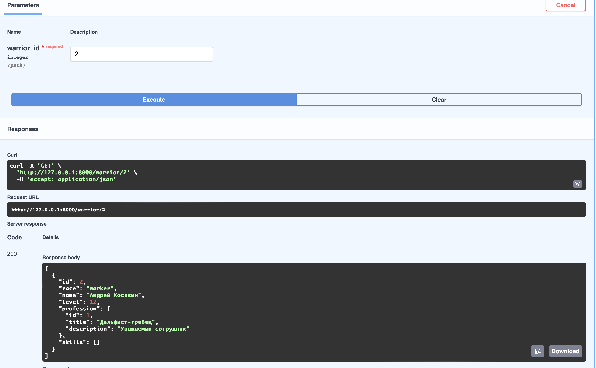

# Практика 1.1. Создание базового приложения на FastAPI

### Ход работы

1. Устанавливаем FastAPI



2.В файле main.py пишем следующий код:
```
from fastapi import FastAPI

app = FastAPI()


@app.get("/")
def hello():
    return "Hello, [username]!"
```
Запускаем сервер и смотрим на результат:
```
uvicorn main:app --reload
```




3.Созаддим временную бд прямо в файле main.py 
```
temp_bd = [{
    "id": 1,
    "race": "director",
    "name": "Мартынов Дмитрий",
    "level": 12,
    "profession": {
        "id": 1,
        "title": "Влиятельный человек",
        "description": "Эксперт по всем вопросам"
    },
},
    {
        "id": 2,
        "race": "worker",
        "name": "Андрей Косякин",
        "level": 12,
        "profession": {
            "id": 1,
            "title": "Дельфист-гребец",
            "description": "Уважаемый сотрудник"
        },
    },
]
```

И для новой бд напишем запросы:


4.Тестируем написанные запросы, вновь запускаем сервер и смотрим на результат:











