# Практика 1.2. Настройка БД, SQLModel и миграции через Alembic

### Ход работы

1.Устанавливаем SQLModel

```
pip install sqlmodel
pip install psycopg2-binary
```
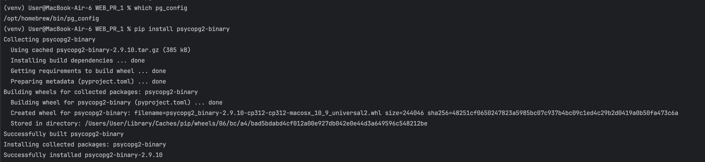

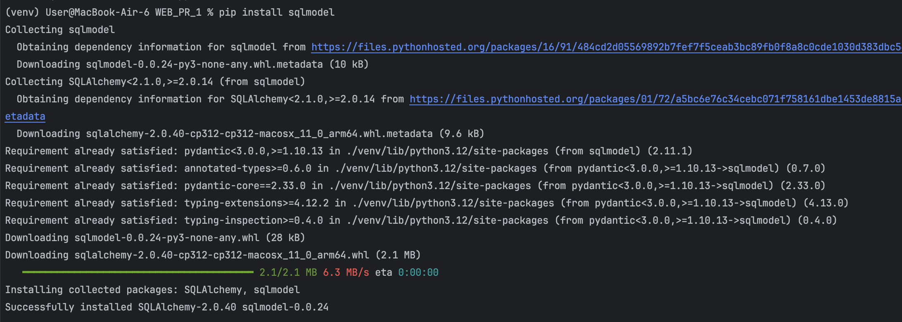

2.После установки всех зависимостей создаем файл с реализацией подключения к БД:
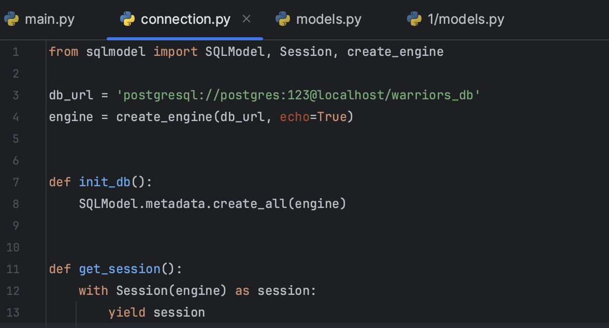

3.Не забывыаем про созданием самих моделей:
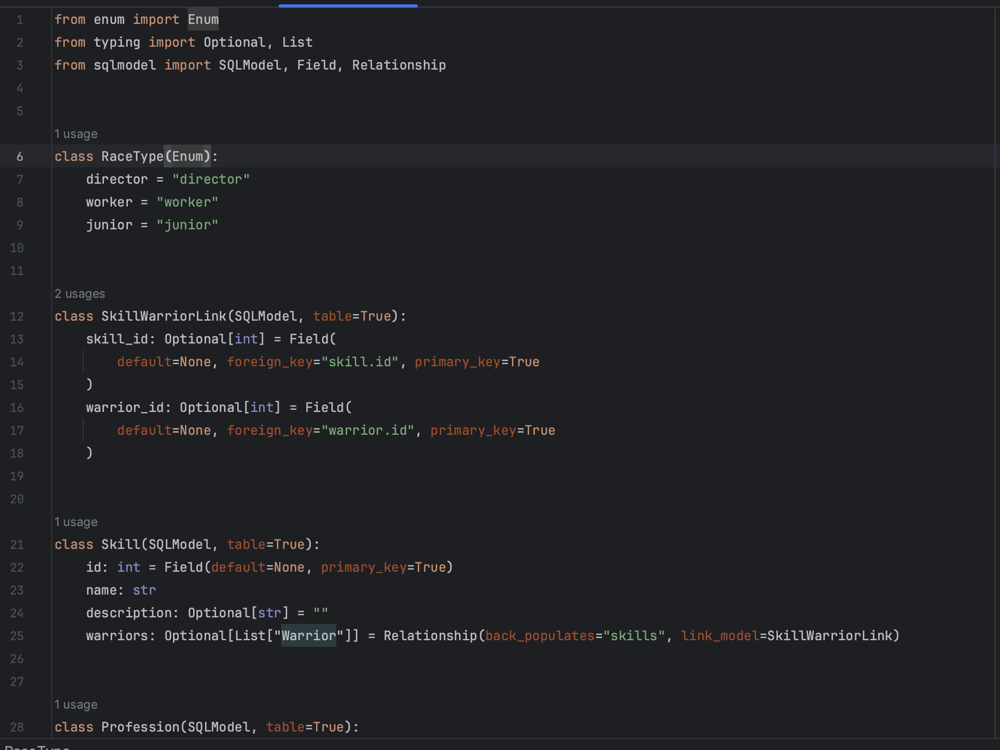

4.Редактируем main.py, добавив этот код для инициализации БД:
```
@app.on_event("startup")
def on_startup():
    init_db()
```

Смотрим на результат. После запуска приложения в консоли выведется SQL-запрос на создание сущностей, описанных в models.py
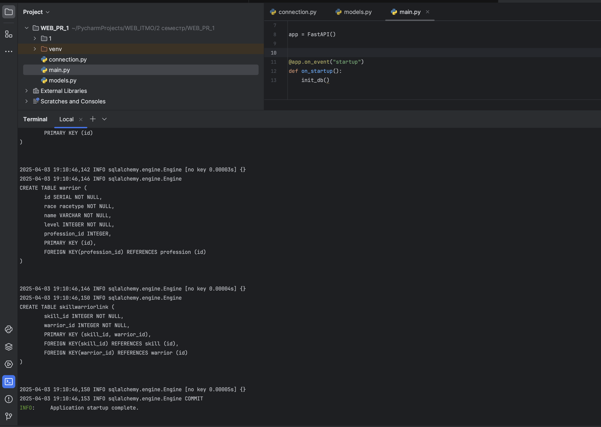

Также зайдем в PostgreSQL и посомтрим на созданные базы данных:
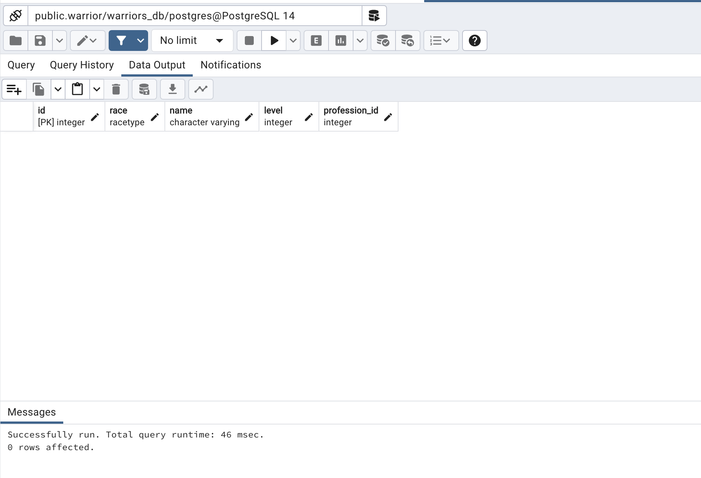


4.Напишем теперь запросы:
```
@app.get("/warriors_list")
def warriors_list(session=Depends(get_session)) -> List[Warrior]:
    return session.exec(select(Warrior)).all()


@app.get("/warrior/{warrior_id}", response_model=WarriorProfessions)
def warriors_get(warrior_id: int, session=Depends(get_session)) -> Warrior:
    warrior = session.get(Warrior, warrior_id)
    return warrior


@app.patch("/warrior{warrior_id}")
def warrior_update(warrior_id: int, warrior: WarriorDefault, session=Depends(get_session)) -> WarriorDefault:
    db_warrior = session.get(Warrior, warrior_id)
    if not db_warrior:
        raise HTTPException(status_code=404, detail="Warrior not found")
    warrior_data = warrior.model_dump(exclude_unset=True)
    for key, value in warrior_data.items():
        setattr(db_warrior, key, value)
    session.add(db_warrior)
    session.commit()
    session.refresh(db_warrior)
    return db_warrior


@app.get("/professions_list")
def professions_list(session=Depends(get_session)) -> List[Profession]:
    return session.exec(select(Profession)).all()


@app.get("/profession/{profession_id}")
def profession_get(profession_id: int, session=Depends(get_session)) -> Profession:
    return session.get(Profession, profession_id)
```

И протестируем их:
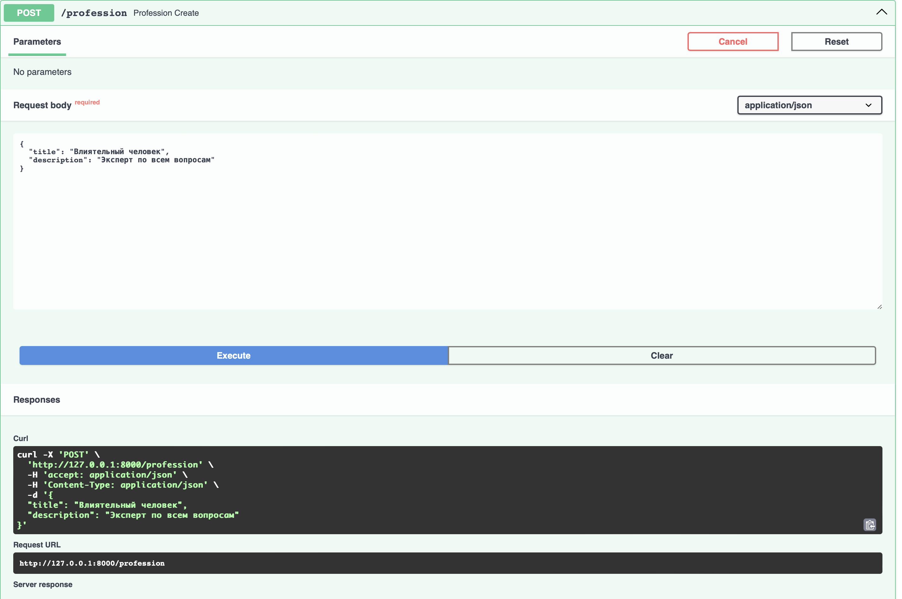

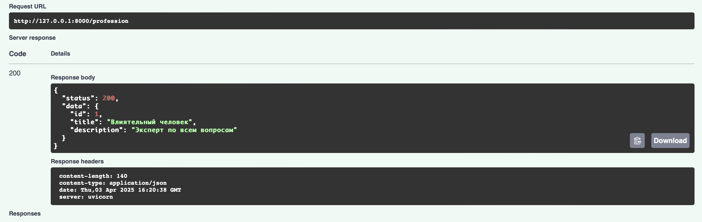

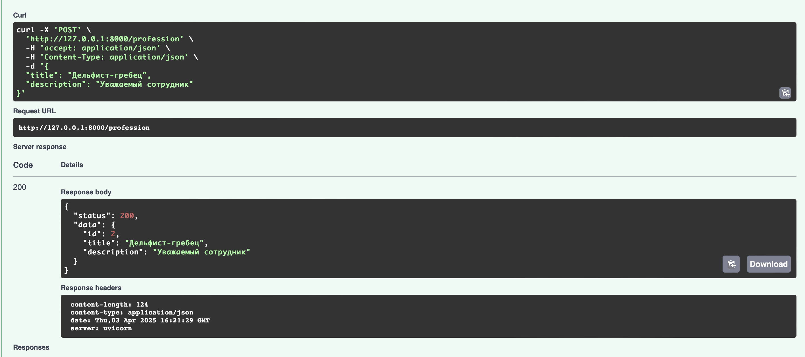

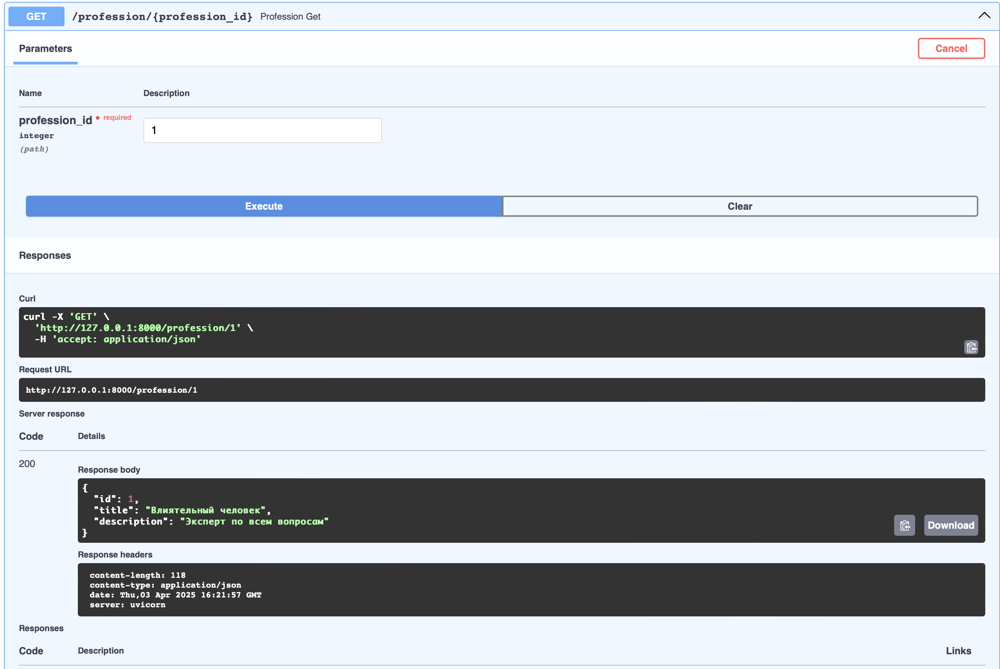

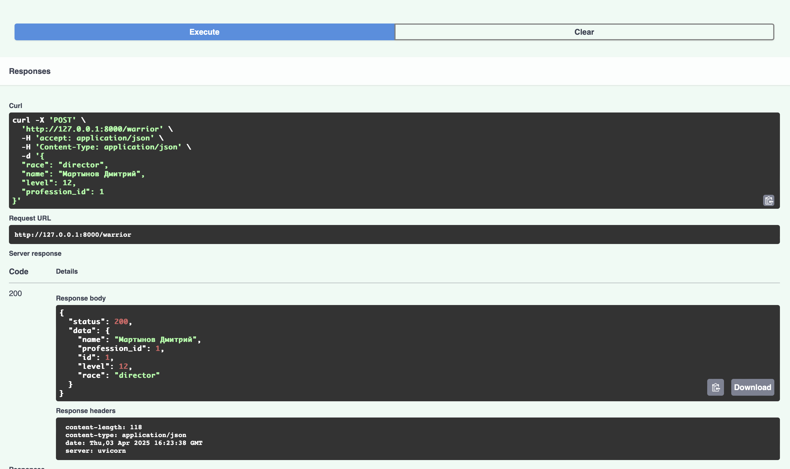

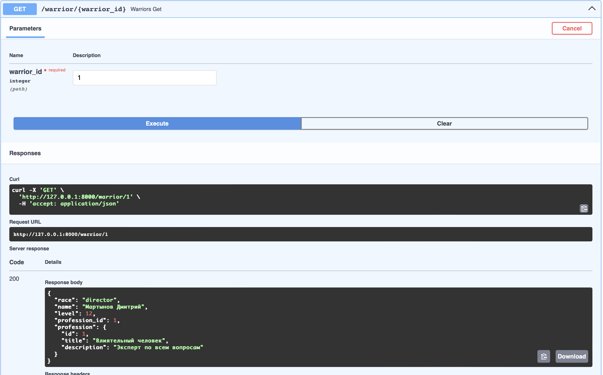

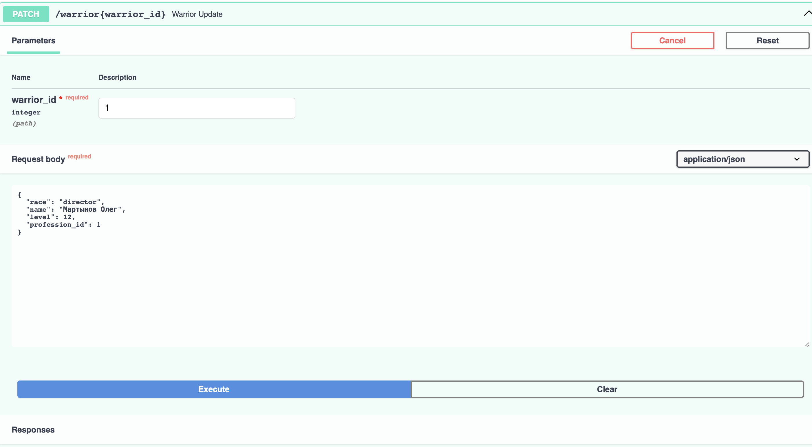

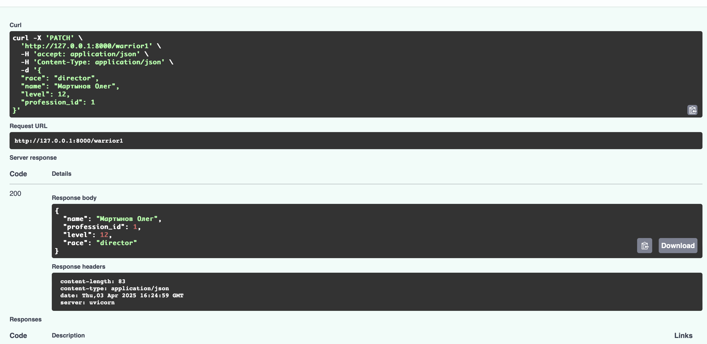

В качестве проверки вновь зайдем в PostgreSQl м проверим одну из таблиц:
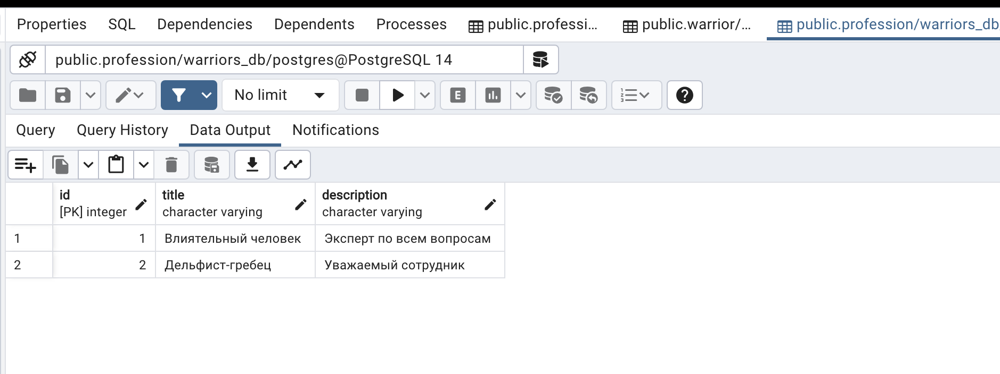

