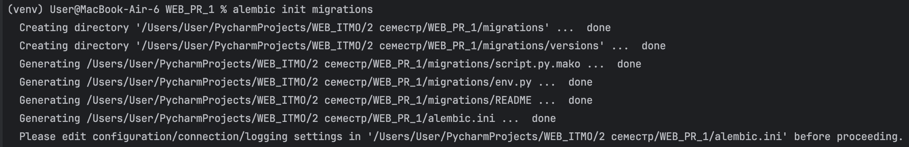
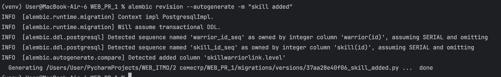
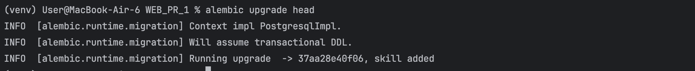
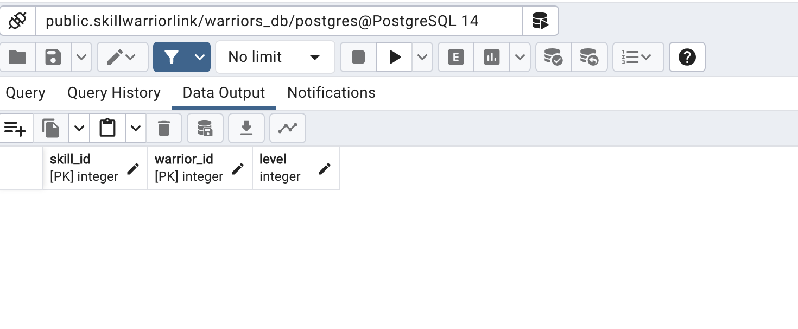

# Практика 1.3. Миграции, ENV, GitIgnore и структура проекта

### Ход работы

1. Устанавливаем alembic
```
pip install alembic 
```
И сгенерируем папку с миграциями и сопутствующие файлы настроек:


2.Для создания миграций в SQLModel необходимо добавить импорты моделей и настроить подключение к БД:

- В файле alembic.ini переменной sqlalchemy.url указываем адрес БД из переменной DB_ADMIN, которая зранится в файле .env
```
sqlalchemy.url = ${DB_ADMIN}
```
- В файле env.py импортируем все из models.py и в переменной target_metadata указываем значение target_metadata=SQLModel.metadata
```
from models import *

from alembic import context
from sqlmodel import SQLModel
from dotenv import load_dotenv

load_dotenv()
database_url = os.getenv('DB_ADMIN')

# this is the Alembic Config object, which provides
# access to the values within the .ini file in use.
config = context.config
config.set_main_option('sqlalchemy.url', database_url)
# Interpret the config file for Python logging.
# This line sets up loggers basically.
if config.config_file_name is not None:
    fileConfig(config.config_file_name)

# add your model's MetaData object here
# for 'autogenerate' support
# from myapp import mymodel
# target_metadata = mymodel.Base.metadata
target_metadata = SQLModel.metadata
```

- В файле script.py.mako импортировать библиотеку sqlmodel
```
import sqlmodel
```

3.Теперь попробуем сделать первые изменения и применить к ним миграции. Добавляем level поле модели SkillWarriorLink:
```
class SkillWarriorLink(SQLModel, table=True):
    skill_id: Optional[int] = Field(
    default=None, foreign_key="skill.id", primary_key=True
    )
    warrior_id: Optional[int] = Field(
    default=None, foreign_key="warrior.id", primary_key=True
    )
    level: int | None
```
Применяем миграции:




Залезем в БД и посмотрим, что у нас добавилось поле level:


4.Также поработаем с файлом gitignore и наполним его необходимым содержимым:
```
.idea
.ipynb_checkpoints
.mypy_cache
.vscode
__pycache__
.pytest_cache
htmlcov
dist
site
.coverage
coverage.xml
.netlify
test.db
log.txt
Pipfile.lock
env3.*
env
docs_build
site_build
venv
docs.zip
archive.zip

# vim temporary files
*~
.*.sw?
.cache

# macOS
.DS_Store

*.env
```

5.Устанавливаем .env и применяем изменения для подключения к БД в файле connection.py:
```
import os
from dotenv import load_dotenv

load_dotenv()
db_url = os.getenv('DB_ADMIN')
```